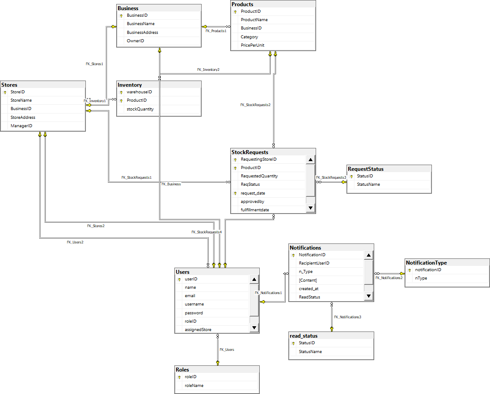

# **Database Diagram Legend**  

### **1. :key: Primary Key (PK)**  
   - The **Golden Key Symbol** represents a **Primary Key** within a table.  
   - When linked to another table alongside **:white_circle::white_circle:**, it indicates the **Referenced Table** in a **Foreign Key (FK) relationship**.  

### **2. :link: Foreign Key (FK) Relationship**  
   - A **link between tables** represents a **Foreign Key relationship**, showing how records are connected across tables.  

### **3. :white_circle::white_circle: Referencing Table**  
   - The **Two White Dots Symbol** denotes the **Referencing Table** in a Foreign Key (FK) relationship.  

### **4. :label: Named Foreign Keys**  
   - **Labels on the links** represent **Named Foreign Keys**, providing meaningful identifiers for relationships between tables.

